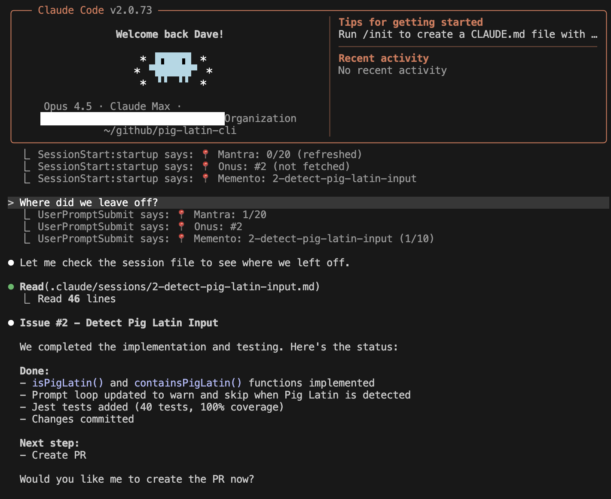

# Claude Domestique

**Your strategic coding partner.**

Like a cycling domestique, it carries the water, stays focused on your goals, and handles the unglamorous work you don't want to do.

---

## The Plugins

### [memento](./memento) — Session Persistence

> "Remember Sammy Jankis."

Like Leonard in *Memento*, Claude can't form long-term memories. Context window fills up, conversation resets, everything vanishes. **memento** gives Claude its tattoos—session files that persist decisions, progress, and context across resets.

Helps developers embody Flexion fundamentals across conversation boundaries:
- **Lead by example** — Persists decisions and progress so nothing is lost to "fixed bug" amnesia
- **Empower customers to adapt** — Enables team handoffs with full context of what was done and why
- **Design as you go** — Captures evolving understanding as key details emerge during work

### [mantra](./mantra) — Behavioral Rules

> "I told you. You agreed. You forgot. Repeat."

You've written the perfect CLAUDE.md. Claude reads it. Claude agrees. By turn 47, Claude ignores half of it. **mantra** provides curated behavioral rules that are automatically loaded via Claude Code's native `.claude/rules/` mechanism—ensuring consistent behavior from turn 1 to turn 100.

Helps developers embody Flexion fundamentals throughout long sessions:
- **Be skeptical and curious** — Keeps Claude questioning assumptions and seeking evidence, not pattern-matching
- **Never compromise on quality** — Maintains consistent standards from turn 1 to turn 100
- **Listen with humility** — Enforces peer-not-subordinate stance, deferring to evidence over agreement

### [onus](./onus) — Work-Item Automation

> "The burden is mine now."

JIRA tickets, Azure DevOps work items, commit messages, PR descriptions. The awful-but-important work that kills your flow. **onus** handles the project management bureaucracy so you can code.

Helps developers embody Flexion fundamentals while staying in flow:
- **Never compromise on quality** — Ensures proper commit messages, ticket updates, and PR descriptions
- **Lead by example** — Handles PM accountability work so it actually gets done
- **Empower customers to adapt** — Keeps stakeholders informed via trackers without breaking developer focus

---

## How They Work Together

```
External (GitHub/JIRA/Azure DevOps)
        │
        ▼ fetch issue details
    [onus]
        │
        ▼ populate session file
    [memento] ←── "What's next?" lookup
        │
        ▼ read session context
    [mantra] ──► native rules auto-loaded
```

Each plugin works standalone but gains enhanced behavior when used together.



*Session resumption showing mantra (context refresh counter), onus (issue tracking), and memento (session file) working together. Claude reads the session file and picks up exactly where the previous conversation left off.*

---

## Requirements

### Required

| Tool | Version | Used By | Purpose |
|------|---------|---------|---------|
| [Claude Code](https://claude.ai/code) | 2.0.12+ | All | Plugin host (plugin system introduced in v2.0.12) |
| [Node.js](https://nodejs.org/) | 18+ | All | Runtime for hooks and scripts |
| [git](https://git-scm.com/) | 2.x | All | Branch detection, commits, session tracking |

### Platform-Specific (onus)

When using `/onus:fetch`, Claude will use these tools to retrieve work items:

| Tool | Platform | Purpose |
|------|----------|---------|
| [GitHub CLI (gh)](https://cli.github.com/) | GitHub | Fetch issues, create PRs (recommended) |
| Claude's WebFetch | JIRA, Azure DevOps | Built-in HTTP tool for API calls |

> **Note**: For JIRA/Azure DevOps, Claude uses its built-in WebFetch capability. No additional tools required.

### Environment Variables (for onus)

| Variable | Platform | How to Get |
|----------|----------|------------|
| `GITHUB_TOKEN` | GitHub | [Create PAT](https://github.com/settings/tokens) with `repo` scope |
| `JIRA_TOKEN` | JIRA | `echo -n "email:api_token" \| base64` ([Get API token](https://id.atlassian.com/manage-profile/security/api-tokens)) |
| `AZURE_DEVOPS_TOKEN` | Azure DevOps | `echo -n ":pat" \| base64` ([Create PAT](https://dev.azure.com/_usersSettings/tokens) with Work Items Read) |

### Verification

```bash
# Check required tools
git --version          # git version 2.x
node --version         # v18.x or higher
claude --version       # Claude Code 2.x

# Check GitHub CLI (optional, for onus with GitHub)
gh --version           # gh version 2.x
gh auth status         # Verify authentication
```

---

## Installation

### Add the Marketplace

```bash
/plugin marketplace add flexion/claude-domestique
```

### Install Plugins

```bash
# Install all three
/plugin install memento@claude-domestique
/plugin install mantra@claude-domestique
/plugin install onus@claude-domestique

# Or just the ones you need
/plugin install mantra@claude-domestique
```

That's it. No initialization required—all plugins use hook-based injection that works automatically.

---

## How Context Injection Works

All three plugins use Claude Code's hook system for zero-config context injection:

| Hook | When | What Gets Injected |
|------|------|-------------------|
| **SessionStart** | New conversation | Full context: rules, session file, work item details |
| **UserPromptSubmit** | Every prompt | Status line + periodic refresh (every 10 prompts) |

This means:
- **mantra** injects behavioral rules automatically—no copying files to `.claude/rules/`
- **memento** creates session files on first prompt for feature branches
- **onus** detects issue numbers from branch names and injects work item context

### Status Line

Each prompt shows plugin status:
```
📍 Mantra: #3 ✓ | 📂 Memento: session.md | 📋 Onus: #42
```

---

## Commands

| Plugin | Command | Description |
|--------|---------|-------------|
| memento | `/memento:session` | Show current session status or create new session |
| mantra | `/mantra:make-rule` | Create compact frontmatter rule from verbose markdown |
| onus | `/onus:fetch` | Fetch issue details from tracker |
| onus | `/onus:create` | Create new work item |
| onus | `/onus:update` | Update work item (comment, status, fields) |
| onus | `/onus:close` | Close a work item |

---

## Development

### Version Management

Bump plugin versions consistently across all config files:

```bash
node scripts/bump-version.js <plugin> <patch|minor|major>

# Examples:
node scripts/bump-version.js memento patch   # 0.1.10 → 0.1.11
node scripts/bump-version.js mantra minor    # 0.1.5 → 0.2.0
```

This updates `package.json`, `plugin.json`, and `marketplace.json` atomically.

### Testing

Each plugin has its own test suite:

```bash
cd mantra && npm test   # Jest
cd memento && npm test  # Node test runner
cd onus && npm test     # Jest
```

---

## Shared Conventions

All plugins agree on this mapping:

```
Issue #42 (tracker)
    ↓
Branch: issue/feature-42/description
    ↓
Metadata: .claude/branches/issue-feature-42-description
    ↓
Session: .claude/sessions/issue-feature-42-description.md
```

---

## Rules System

mantra injects behavioral rules via hooks—no file copying required. Rules are frontmatter-only markdown files with compact YAML, injected directly into Claude's context.

### What mantra Provides

On every session start, mantra injects:

| Rule | Purpose |
|------|---------|
| `behavior.md` | AI behavior (skeptical-first, evidence-based) |
| `context-format.md` | Context module format spec |
| `format-guide.md` | Compact YAML conventions |
| `test.md` | Testing conventions (TDD workflow) |
| `git.md` | Git workflow (commits, PRs, branches) |
| `sessions.md` | Session management conventions |
| `work-items.md` | Work item integration |

Rules from sibling plugins (memento, onus) are automatically included when installed together.

### Creating Custom Rules

Use `/mantra:make-rule` to create your own rules:

1. Write a verbose, human-readable markdown file
2. Run `/mantra:make-rule your-guide.md`
3. Claude converts it to token-efficient frontmatter
4. Identify which rules are CRITICAL (used sparingly)
5. Save to `.claude/rules/your-rule.md`

### Rule File Format

Each rule file is a **frontmatter-only markdown file**:

```markdown
---
# Project conventions - Compact Reference
companion: project-guide.md

## Git Workflow
branch: WorkItemID-desc | chore/desc
commit: "WorkItemID - verb desc" (HEREDOC format)
test-before: ./gradlew test

## Testing
pyramid: unit > integration > e2e
run-before-commit: unit-tests
run-before-PR: integration-tests
---
```

No markdown body—just frontmatter containing compact YAML.

### Emphasis Markers

Use sparingly for critical rules:

| Marker | Use When |
|--------|----------|
| `MANDATORY-REREAD:` | Must re-read before specific actions |
| `## SECTION (BLOCKING REQUIREMENT)` | Entire section is non-negotiable |
| `required-before:` | Must happen before an action |
| `never:` | Absolute prohibitions |
| `enforcement:` | If→then trigger rules |

### File Format

Rules use compact YAML optimized for Claude:

| Pattern | Meaning | Example |
|---------|---------|---------|
| `→` | Flow/sequence | `implement → test → commit` |
| `>` | Priority | `unit > integration > e2e` |
| `\|` | Alternatives | `issue/feature-N/desc \| chore/desc` |
| `:` | Key-value | `language: typescript` |

Keep files compact: 10-30 lines, no prose, one fact per line.

---

## License

MIT
