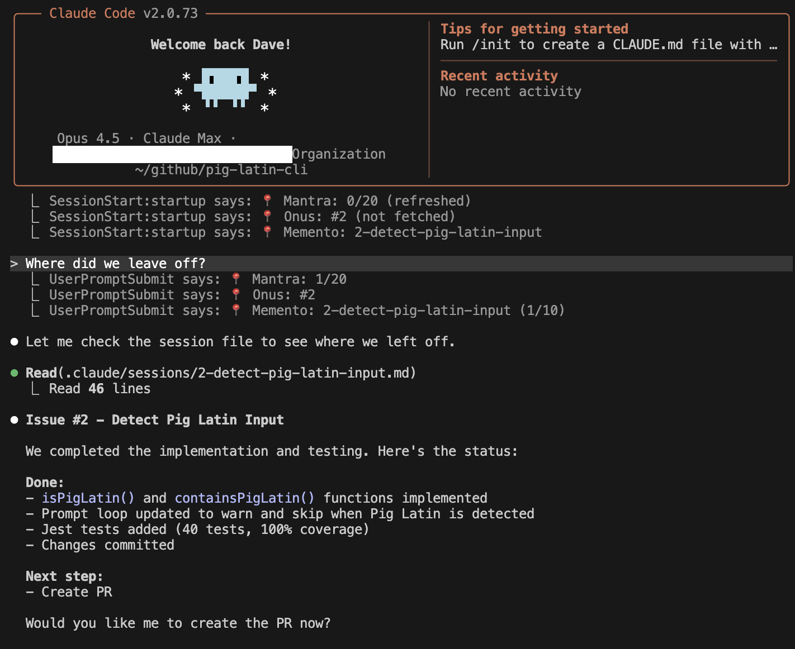

# Claude Domestique

**Your strategic coding partner for Claude Code and Codex.**

Like a cycling domestique, it carries the water, stays focused on your goals, and handles the unglamorous work you don't want to do.

---

## The Plugins

### [memento](./memento) — Session Persistence

> "Remember Sammy Jankis."

Like Leonard in *Memento*, Claude can't form long-term memories. Context window fills up, conversation resets, everything vanishes. **memento** gives Claude its tattoos—session files that persist decisions, progress, and context across resets.

Helps developers embody Flexion fundamentals across conversation boundaries:
- **Lead by example** — Persists decisions and progress so nothing is lost to "fixed bug" amnesia
- **Empower customers to adapt** — Enables team handoffs with full context of what was done and why
- **Design as you go** — Captures evolving understanding as key details emerge during work

### [mantra](./mantra) — Behavioral Rules

> "I told you. You agreed. You forgot. Repeat."

You've documented your project conventions. Claude reads them, then drifts as the conversation grows. **mantra** injects curated behavioral rules through lifecycle hooks and refreshes them during long sessions.

Helps developers embody Flexion fundamentals throughout long sessions:
- **Be skeptical and curious** — Keeps Claude questioning assumptions and seeking evidence, not pattern-matching
- **Never compromise on quality** — Reinforces project standards throughout long sessions
- **Listen with humility** — Enforces peer-not-subordinate stance, deferring to evidence over agreement

### [onus](./onus) — Work-Item Automation

> "The burden is mine now."

JIRA tickets, Azure DevOps work items, commit messages, PR descriptions. The awful-but-important work that kills your flow. **onus** handles the project management bureaucracy so you can code.

Supports **GitHub Issues** (default, zero-config), **JIRA**, and **Azure DevOps** work items.

Helps developers embody Flexion fundamentals while staying in flow:
- **Never compromise on quality** — Ensures proper commit messages, ticket updates, and PR descriptions
- **Lead by example** — Handles PM accountability work so it actually gets done
- **Empower customers to adapt** — Keeps stakeholders informed via trackers without breaking developer focus

### [agent-artifex](./agent-artifex) — AI-Service Design and Testing

Evidence-based workflows for designing, assessing, implementing, and testing MCP servers, agents, chatbots, and tool-calling systems.

### [comitatus](./comitatus) — herdr Orchestration

Agent messaging, herd initialization, and worktree and agent launches through the herdr CLI. Native herdr and Git handle waiting, reading, and integration; the working lead decides when work is complete and what cleanup may discard. The launcher stays outside the spawned herd by default, and a roster member coordinates it.

Codex launches use `--no-daemon`; default models are `claude-opus-5-5` and `gpt-6.1-sol`, with explicit overrides supported. Comitatus 1.0.0 removes the separate fan-out skill, role files, and run-workflow helpers. See the [comitatus README](./comitatus/README.md) for the supported commands and migration details. It remains dormant outside a herdr-managed pane.

### [stilus](./stilus) — Writing and Review

Remove AI slop and review prose for correctness, voice, human readability, and whether the intended point survives.

### [modus](./modus) — Work-Item Guidance

Rewrite work items for people, or carry an item through implementation and assess its tests, verification, refactoring, and review evidence. See the [plugin's status](./modus/README.md#status) for the limits of the evidence behind that guidance.

### [vernaculus](./vernaculus) — Local-Model Delegation

Delegate well-specified coding work to a locally hosted model through MCP. Its skill guides the caller through reviewing, testing, and refining the draft; it requires a running Ollama server and an installed model.

---

## How They Work Together

```
External (GitHub/JIRA/Azure DevOps)
        │
        ▼ fetch issue details
    [onus]
        │
        ▼ populate session file
    [memento] ←── "What's next?" lookup
        │
        ▼ read session context
    [mantra] ──► rules injected and refreshed through hooks
```

Each plugin works standalone but gains enhanced behavior when used together.



*Session resumption showing mantra (context refresh counter), onus (issue tracking), and memento (session file) working together. Claude reads the session file and picks up exactly where the previous conversation left off.*

---

## Requirements

### Required

| Tool | Version | Used By | Purpose |
|------|---------|---------|---------|
| [Claude Code](https://claude.ai/code) | 2.1.226+ | All | Deliberately tested plugin, skill-preloading, subagent, and parity floor |
| Codex CLI | 0.147.0+ | All | Deliberately tested plugin, subagent, and parity floor |
| [Node.js](https://nodejs.org/) | 24+ | All | Runtime for hooks and scripts |
| [git](https://git-scm.com/) | 2.x | All | Branch detection, commits, session tracking |

Choose the host you use. [Comitatus](./comitatus/README.md#installing) also needs herdr and its agent integrations; [vernaculus](./vernaculus/README.md#requirements) needs Ollama and an installed model.

### Platform-Specific (onus)

When using `/onus:fetch`, Claude will use these tools to retrieve work items:

| Tool | Platform | Purpose |
|------|----------|---------|
| [GitHub CLI (gh)](https://cli.github.com/) | GitHub | Fetch issues, create PRs (recommended) |
| Host web/HTTP tools | JIRA, Azure DevOps | API requests when no dedicated CLI is configured |

> **Note**: For JIRA/Azure DevOps, use the authenticated HTTP or web-fetch capability available in the current host.

### Environment Variables (for onus)

| Variable | Platform | How to Get |
|----------|----------|------------|
| `GITHUB_TOKEN` | GitHub | [Create PAT](https://github.com/settings/tokens) with `repo` scope |
| `JIRA_TOKEN` | JIRA | `echo -n "email:api_token" \| base64` ([Get API token](https://id.atlassian.com/manage-profile/security/api-tokens)) |
| `AZURE_DEVOPS_TOKEN` | Azure DevOps | `echo -n ":pat" \| base64` ([Create PAT](https://dev.azure.com/_usersSettings/tokens) with Work Items Read) |

### Verification

```bash
# Check required tools
git --version          # git version 2.x
node --version         # v24.x or higher
claude --version       # Claude Code 2.x

# Check GitHub CLI (optional, for onus with GitHub)
gh --version           # gh version 2.x
gh auth status         # Verify authentication
```

---

## Installation

### Claude Code

```bash
/plugin marketplace add flexion/claude-domestique
/plugin install memento@claude-domestique
/plugin install mantra@claude-domestique
/plugin install onus@claude-domestique
/plugin install agent-artifex@claude-domestique
/plugin install comitatus@claude-domestique
/plugin install stilus@claude-domestique
/plugin install modus@claude-domestique
/plugin install vernaculus@claude-domestique
```

### Codex

```bash
codex plugin marketplace add flexion/claude-domestique
codex plugin add memento@claude-domestique
codex plugin add mantra@claude-domestique
codex plugin add onus@claude-domestique
codex plugin add agent-artifex@claude-domestique
codex plugin add comitatus@claude-domestique
codex plugin add stilus@claude-domestique
codex plugin add modus@claude-domestique
codex plugin add vernaculus@claude-domestique
```

Codex users must review and trust plugin hooks before hook-enabled plugins can run lifecycle automation. Skills remain available without trusting hooks.

That's it. No initialization required—plugins load automatically once installed. See each plugin's README for specifics (comitatus, for instance, stays dormant unless you're inside a herdr pane).

---

## How Context Injection Works

Mantra, Memento, Onus, and Comitatus inject context through lifecycle hooks in both hosts. Each plugin defines which events it handles; Codex hooks require the trust described above.

| Hook | When | What Gets Injected |
|------|------|-------------------|
| **SessionStart** | New conversation | Plugin-specific rules, session or work-item context, or herdr orientation |
| **UserPromptSubmit** | Each prompt, for plugins that handle it | Status and context refresh according to that plugin's rules |

This means:
- **mantra** injects behavioral rules automatically—no copying files to `.claude/rules/`
- **memento** creates session files on first prompt for feature branches
- **onus** detects issue numbers from branch names and injects work item context
- **comitatus** injects a short orientation when `HERDR_ENV=1`; agents read the herdr skill for its guidance

### Status Line

Each prompt shows plugin status:
```
📍 Mantra: #3 ✓ | 📂 Memento: session.md | 📋 Onus: #42
```

---

## Skills

Claude Code invokes a plugin skill as `/plugin:skill`; Codex invokes it as `$plugin:skill`. The same `SKILL.md` implements both forms.

Selected entry points are listed below. Each plugin's README explains its usage and requirements.

| Plugin | Command | Description |
|--------|---------|-------------|
| memento | `/memento:start` | Start new work - creates branch and session together |
| memento | `/memento:session` | Show current session status or create new session |
| mantra | `/mantra:make-rule` | Create compact frontmatter rule from verbose markdown |
| onus | `/onus:init` | Initialize project config (detects commit patterns) |
| onus | `/onus:fetch` | Fetch issue details from tracker |
| onus | `/onus:create` | Create new work item |
| onus | `/onus:update` | Update work item (comment, status, fields) |
| onus | `/onus:close` | Close a work item |
| onus | `/onus:commit` | Create a commit with validation and format guidance |
| onus | `/onus:pr` | Create a pull request with validation and format guidance |
| agent-artifex | `/agent-artifex:guide` | Choose an AI-service design, implementation, or assessment workflow |
| comitatus | `/comitatus:herdr` | Manage agents, messages, and herds inside herdr |
| comitatus | `/comitatus:herd-setup` | Configure herdr command permissions |
| stilus | `/stilus:deslop` | Edit prose to remove formulaic phrasing |
| stilus | `/stilus:review` | Review finished prose for correctness and clarity |
| modus | `/modus:human-work-item` | Rewrite an unclear item for a person |
| modus | `/modus:agent-work-item` | Implement an item and assess completion evidence |
| vernaculus | `/vernaculus:delegate-to-local-model` | Delegate and verify a local model's coding draft |

---

## Development

### Version Management

Bump plugin versions consistently across all config files:

```bash
node scripts/bump-version.js <plugin> <patch|minor|major>

# Examples:
node scripts/bump-version.js memento patch
node scripts/bump-version.js mantra minor
```

This updates the plugin's package version when present, its Claude and Codex manifests, and the marketplace entry. Bump each modified plugin once per branch after substantive edits; repository-only documentation does not need a plugin bump.

### Testing

Run workspace tests and metadata validation from the repository root:

```bash
npm run install:all
npm test
npm run validate:plugins

# Focused suites
npm run test:comitatus
npm run test:vernaculus
```

Plugins with JavaScript have Jest suites; skills-only plugins use manifest, reference, and fresh-host invocation checks. See [AGENTS.md](./AGENTS.md#setup-build-and-tests) for the Claude and Codex validation commands and skill probes.

---

## Shared Conventions

Issue-based work follows this repository convention:

```
Issue #42 (tracker)
    ↓
Branch: issue/feature-42/description
    ↓
Metadata: .claude/branches/issue-feature-42-description
    ↓
Session: .claude/sessions/issue-feature-42-description.md
```

---

## Rules System

mantra injects compact behavioral rules through hooks in both hosts and includes rules from installed sibling plugins. Companion documents provide detail on demand.

The [mantra README](./mantra/README.md#what-gets-injected) owns the rule inventory and format. Use [make-rule](./mantra/skills/make-rule/SKILL.md) to create custom rules.

---

## License

MIT
