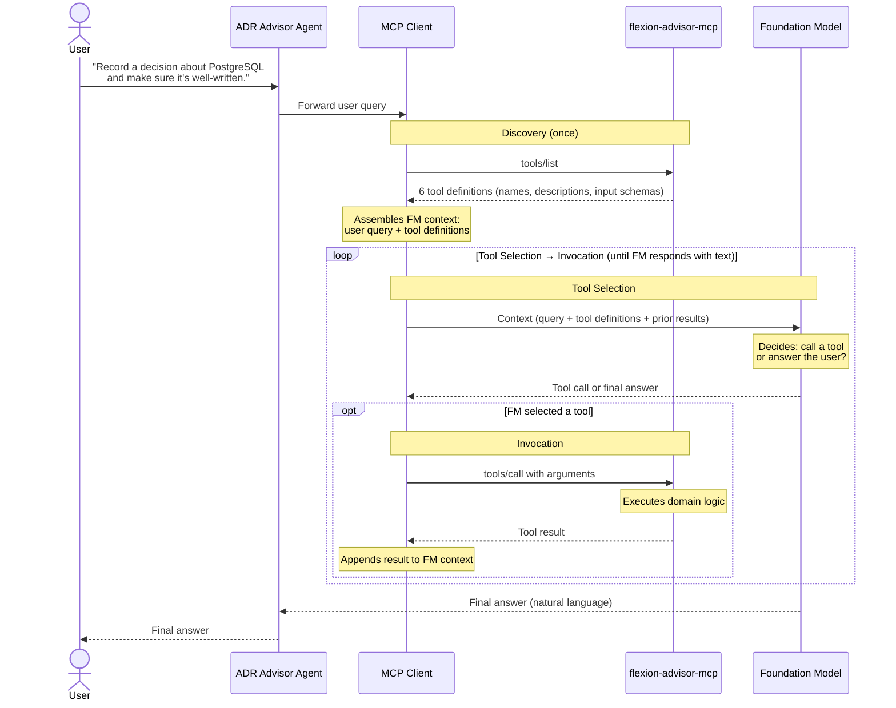

# AI Services Framework

> The foundational framework for designing and testing AI tool services — MCP servers, agents, chatbots, and tool-calling systems.
>
> Grounded in empirical findings from Hasan et al., "MCP Tool Descriptions Are Smelly!" ([arXiv 2602.14878v1](https://arxiv.org/html/2602.14878v1)), the [MCP specification](https://modelcontextprotocol.io/specification/2025-06-18/server/tools), and industry evaluation guidance from Anthropic, RAGAS, and Google DeepMind.
>
> For design principles, see [Designing AI Services for Response Quality](design-for-quality.md). This document covers the causal chain, runtime interaction model, and testing methodology that underpin both design and testing guidance.

---

## MCP Runtime Interaction Loop

Discovery happens once. Tool Selection and Invocation loop until the FM decides it has enough information to answer the user.



### Example: multi-step workflow

For the query "Record a decision about PostgreSQL and make sure it's well-written," the loop iterates twice:

| Iteration | Tool Selection | Invocation |
|---|---|---|
| 1 | FM selects `create_adr` with title, context, decision, consequences | Server creates ADR, returns `{id, number, title, ...}` |
| 2 | FM sees new ADR ID, selects `assess_adr_quality` with that ID | Server runs quality check, returns `{score, criteria, ...}` |
| 3 | FM has both results, produces final answer | *(no tool call — loop exits)* |

The FM's decision at each iteration depends entirely on what's in its context window: the original query, the tool definitions, and all prior tool results.[^1]

---

## What matters

The true quality of an MCP tool service is the quality of the response the user receives. Everything else — tool descriptions, tool selection, server behavior — is in service of that outcome. A user doesn't care whether your rubric scores are high or your schemas are consistent; they care whether the answer is faithful, complete, and correct.

The five areas below form a **causal chain**, not a checklist of equals:

```
Tool Description Quality → Agent Behavior → Server Correctness → Response Accuracy
       (leading)              (leading)          (leading)            (outcome)
```

Description quality shapes tool selection. Tool selection determines which server logic runs. Server results feed the FM's synthesis. But a system can score well on the first three and still produce a hallucinated answer — or score poorly on description rubrics and still deliver accurate responses. **Response Accuracy is the only measure the user experiences.** The other three are leading indicators that help diagnose *why* response accuracy is high or low.

Test all four, but never lose sight of which one is the scoreboard.

## The Five Areas

| Section | MCP Spec Term | Test type | Role |
|---|---|---|---|
| [Tool Description Quality](tool-description-quality.md) | Discovery | Structural (no LLM) | Leading indicator |
| [Agent Behavior](agent-behavior.md) | Tool Selection | Behavioral (LLM in loop) | Leading indicator |
| [Server Correctness](server-correctness.md) | Invocation | Deterministic | Leading indicator |
| [Response Accuracy](response-accuracy.md) | *(full loop)* | End-to-end (LLM + ground truth) | **Outcome** |
| [Chatbot Integration](chatbot-testing.md) | *(multi-turn)* | Behavioral (LLM in loop, multi-turn) | **Integration layer** |

The first three test segments of the interaction loop in isolation. Response Accuracy is the only **end-to-end test** — it exercises the full chain from user prompt through discovery, tool selection, invocation, and synthesis, then verifies the answer the user actually receives. Chatbot Integration extends Agent Behavior and Response Accuracy into multi-turn conversational contexts — testing coreference resolution, context pressure, workflow orchestration, system prompt interaction, presentation quality, and graceful degradation.

---

## Impact and effort

### Relative impact on response quality

No study provides a controlled experiment isolating the causal contribution of each protocol phase independently. However, the available evidence lets us rank their influence:

| Guideline | Impact on response quality | Evidence |
|---|---|---|
| **Tool Description Quality** | **High — and the only phase with empirical measurement.** Augmenting descriptions improved task success rate by +5.85pp and evaluator scores by +15.12%.[^2] Defective descriptions are the root cause: "the FM may select the wrong tool, supply invalid or suboptimal arguments, or take unnecessary interaction steps."[^3] | Hasan et al. RQ-2 |
| **Agent Behavior** | **High — but inseparable from description quality.** The paper measures tool selection accuracy as a *consequence* of description quality, not as an independent variable. When descriptions improved, selection improved. The two are coupled.[^4] | Hasan et al. RQ-2, RQ-3 |
| **Server Correctness** | **Assumed high, but unmeasured.** The paper treats invocation as a pass-through.[^5] However, tool results feed directly into the FM's context for the next iteration[^6] — a malformed result degrades every subsequent decision. Standard software engineering treats API correctness as table stakes.[^7] | MCP Spec, Fowler |
| **Response Accuracy** | **This is the outcome, not a contributor.** It doesn't influence itself — it *is* the thing being influenced. It is the only measure the user experiences.[^8] | Anthropic |
| **Chatbot Integration** | **High — and invisible to single-turn tests.** Conversational context introduces failure modes (coreference corruption, context pressure degradation, workflow fragmentation) that compound single-turn quality into multi-turn unreliability. A server that passes all four single-turn guidelines can still produce wrong answers at turn 15. | No direct empirical measurement — these are integration-layer concerns observed in production chatbot deployments. |

The key insight from Hasan et al. is that the impact of description quality is **real but domain-and-model-dependent** — no single component combination consistently improves performance across all domains and models.[^9] This means the relative weight of each phase shifts depending on context, reinforcing the need for end-to-end testing rather than relying on any single leading indicator.

### Level of effort to test

The AI agent testing pyramid[^10] replaces the traditional unit/integration/e2e layers with layers of **uncertainty tolerance** — from deterministic at the base to probabilistic at the top. This maps directly to our four guidelines:

| Guideline | Effort | Cost per run | Determinism | CI/CD | Rationale |
|---|---|---|---|---|---|
| **Tool Description Quality** | Low | Near zero | Fully deterministic | Every commit | Structural analysis: rubric scoring, token counting, cosine similarity. No LLM calls needed.[^11] |
| **Server Correctness** | Low | Near zero | Fully deterministic | Every commit | Standard unit/integration tests: golden-file assertions, schema validation, error format checks. Mock providers, no LLM calls.[^10] |
| **Agent Behavior** | Medium–High | LLM API costs | Non-deterministic | On-demand | LLM in the loop for tool selection and argument quality. Must run multiple times and aggregate — "a single run tells us almost nothing but patterns tell us everything."[^12] |
| **Response Accuracy** | High | LLM API costs × full loop | Non-deterministic | On-demand | Full end-to-end: seed data, run the complete interaction loop, verify the answer against ground truth. Most expensive, but the only test that measures what the user receives.[^13] |
| **Chatbot Integration** | Very High | LLM API costs × full loop × conversation depth | Non-deterministic | On-demand | Multi-turn conversations with coreference resolution, context pressure at varying depths, workflow orchestration, and failure injection. The most expensive tests in the guidelines — reserve for pre-deployment validation. |

Anthropic recommends: "Prefer deterministic graders where possible; use LLM graders where necessary."[^14] Block Engineering is more direct: "Don't run live LLM tests in CI. Too expensive, too slow, too flaky. CI validates the deterministic layers. Humans validate the rest when it matters."[^10]

OpenAI's scalability path: "Once the LLM judge reaches a point where it's faster, cheaper, and consistently agrees with human annotations, scale up."[^15] Start with human evaluation to establish ground truth, then calibrate automated methods against it.

The practical implication: **invest heavily in cheap, deterministic tests (Tool Description Quality and Server Correctness) that run on every commit, and reserve expensive end-to-end tests (Agent Behavior and Response Accuracy) for on-demand validation.** When end-to-end tests fail, the leading indicators help diagnose which phase broke.

---

## Sources

All assertions in the guideline documents are grounded in authoritative sources, downloaded to `sources/` for traceability:

| Source | Local copy |
|---|---|
| Hasan et al., "MCP Tool Descriptions Are Smelly!" ([arXiv 2602.14878v1](https://arxiv.org/html/2602.14878v1)) | [`sources/mcp-tool-description-smells.txt`](sources/mcp-tool-description-smells.txt) |
| Briefing document (extracted findings with 56 footnotes) | [`sources/briefing-mcp-tool-description-smells.md`](sources/briefing-mcp-tool-description-smells.md) |
| MCP Specification, Tools (2025-06-18) | [`sources/mcp-spec-tools-2025-06-18.md`](sources/mcp-spec-tools-2025-06-18.md) |
| MCP Documentation, Tools (Concepts) | [`sources/mcp-spec-tools-concepts.md`](sources/mcp-spec-tools-concepts.md) |
| Anthropic, "Demystifying Evals for AI Agents" | [`sources/anthropic-demystifying-evals.md`](sources/anthropic-demystifying-evals.md) |
| RAGAS, Evaluation metrics (arXiv:2309.15217) | [`sources/ragas-metrics.md`](sources/ragas-metrics.md) |
| RFC 9457 (IETF), "Problem Details for HTTP APIs" | [`sources/rfc-9457-problem-details.md`](sources/rfc-9457-problem-details.md) |
| Fowler, M., "ContractTest" | [`sources/fowler-contract-test.md`](sources/fowler-contract-test.md) |
| Google DeepMind, FACTS Grounding | [`sources/deepmind-facts-grounding.md`](sources/deepmind-facts-grounding.md) |
| Jones, A. (2026), "Testing Pyramid for AI Agents" | [`sources/block-testing-pyramid-ai-agents.md`](sources/block-testing-pyramid-ai-agents.md) |
| OpenAI, "Evaluation Best Practices" | [`sources/openai-evaluation-best-practices.md`](sources/openai-evaluation-best-practices.md) |
| Anthropic, "Building Evals" cookbook | [`sources/anthropic-building-evals.md`](sources/anthropic-building-evals.md) |
| Anthropic, "How to Implement Tool Use" | [`sources/anthropic-implement-tool-use.md`](sources/anthropic-implement-tool-use.md) |
| Jest, "Snapshot Testing" | [`sources/jest-snapshot-testing.md`](sources/jest-snapshot-testing.md) |
| Wang et al., "MINT: Evaluating LLMs in Multi-turn Interaction" ([ICLR 2024](https://arxiv.org/abs/2309.10691)) | [`sources/wang-mint-multi-turn-interaction.md`](sources/wang-mint-multi-turn-interaction.md) |
| Liu et al., "Lost in the Middle" ([TACL 2024](https://arxiv.org/abs/2307.03172)) | [`sources/liu-lost-in-the-middle.md`](sources/liu-lost-in-the-middle.md) |
| Du et al., "Context Length Alone Hurts LLM Performance" ([EMNLP Findings 2025](https://aclanthology.org/2025.findings-emnlp.1264/)) | [`sources/du-context-length-hurts-performance.md`](sources/du-context-length-hurts-performance.md) |
| Chatterjee & Agarwal, "Semantic Anchoring in Agentic Memory" ([arXiv 2025](https://arxiv.org/abs/2508.12630)) | [`sources/chatterjee-semantic-anchoring-agentic-memory.md`](sources/chatterjee-semantic-anchoring-agentic-memory.md) |
| Hasan et al., "Testing Practices in AI Agent Frameworks" ([arXiv 2025](https://arxiv.org/abs/2509.19185)) | [`sources/hasan-testing-practices-ai-agents.md`](sources/hasan-testing-practices-ai-agents.md) |
| Microsoft ISE, "Evaluation Framework for Agentic Chatbots" ([DevBlogs](https://devblogs.microsoft.com/ise/intuitive-evaluation-framework-for-agentic-chatbots/)) | [`sources/microsoft-ise-chatbot-evaluation.md`](sources/microsoft-ise-chatbot-evaluation.md) |
| Anthropic, "Writing Tools for Agents" ([Engineering Blog](https://www.anthropic.com/engineering/writing-tools-for-agents)) | [`sources/anthropic-writing-tools-for-agents.md`](sources/anthropic-writing-tools-for-agents.md) |
| Anthropic, "Introducing Advanced Tool Use" ([Engineering Blog](https://www.anthropic.com/engineering/advanced-tool-use)) | [`sources/anthropic-advanced-tool-use.md`](sources/anthropic-advanced-tool-use.md) |
| OpenAI, "Function Calling" ([API Docs](https://developers.openai.com/api/docs/guides/function-calling)) | [`sources/openai-function-calling.md`](sources/openai-function-calling.md) |
| OpenAI, "o3/o4-mini Function Calling Guide" ([Cookbook](https://developers.openai.com/cookbook/examples/o-series/o3o4-mini_prompting_guide)) | [`sources/openai-o3-function-calling-guide.md`](sources/openai-o3-function-calling-guide.md) |

---

[^1]: Hasan et al. §3.1: "The MCP client mediates between the FM and one or more MCP servers, each exposing tool metadata, e.g., name, description, and input schema, to the model."

[^2]: Hasan et al. §5.2: "Augmented tool descriptions yield a statistically significant increase of 5.85 percentage points in task success rate...increasing the Average Evaluator score by 15.12%."

[^3]: Hasan et al. §1: "if the tool descriptions are defective, underspecified, or misleading, the FM may select the wrong tool, supply invalid or suboptimal arguments, or take unnecessary interaction steps, ultimately reducing the reliability of MCP-enabled systems"

[^4]: Hasan et al. §5.3: The ablation study measures tool selection accuracy as a function of description component combinations — Purpose + Guidelines achieves 67.50% SR vs. 57.50% for full augmentation in Finance/GPT-4.1 (Table 7). Tool selection quality is measured but only as a response to description changes, never independently.

[^5]: Hasan et al. §3.1, point (3): "the MCP client validates parameters, seeks user consent for sensitive actions, and executes the call through the appropriate server"

[^6]: Hasan et al. §3.1/Figure 1: After invocation, "the agent returns the tool response to the FM, which synthesizes the final answer for the user" — tool results feed directly into the next Tool Selection iteration's context.

[^7]: Fowler, M. "ContractTest": "Contract tests check the contract of external service calls...the format of the data matters rather than the actual data." ([source](https://martinfowler.com/bliki/ContractTest.html); local copy: `sources/fowler-contract-test.md`)

[^8]: Anthropic, "Demystifying Evals for AI Agents": "it's often better to grade what the agent produced, not the path it took." ([source](https://www.anthropic.com/engineering/demystifying-evals-for-ai-agents); local copy: `sources/anthropic-demystifying-evals.md`)

[^9]: Hasan et al. §5.3: "no single combination of MCP tool description components consistently yields improved performance across all domains and models"

[^10]: Jones, A. (2026). "Testing Pyramid for AI Agents." Block Engineering Blog. Layers represent "how much uncertainty you're willing to tolerate." Base layer: "fast, cheap, and completely deterministic." CI philosophy: "Don't run live LLM tests in CI. Too expensive, too slow, too flaky." ([source](https://engineering.block.xyz/blog/testing-pyramid-for-ai-agents); local copy: `sources/block-testing-pyramid-ai-agents.md`)

[^11]: Hasan et al. §4.1–4.3: The six-component rubric scoring and smell detection are structural properties of the descriptions themselves — measurable by FM-based scanning without executing the tools.

[^12]: Jones, A. (2026). "Testing Pyramid for AI Agents": "A single run tells us almost nothing but patterns tell us everything." Benchmarks "run multiple times and aggregate results. Regression does not mean 'the output changed.' It means 'success rates dropped.'" ([source](https://engineering.block.xyz/blog/testing-pyramid-for-ai-agents); local copy: `sources/block-testing-pyramid-ai-agents.md`)

[^13]: Anthropic, "Building Evals" cookbook: Evaluation uses seeded inputs, model execution, golden-answer comparison, and grading — the closed-loop pattern. "Code-based grading is the best grading method if possible, as it is fast and highly reliable." ([source](https://github.com/anthropics/anthropic-cookbook/blob/main/misc/building_evals.ipynb); local copy: `sources/anthropic-building-evals.md`)

[^14]: Anthropic, "Demystifying Evals for AI Agents": "Prefer deterministic graders where possible; use LLM graders where necessary." Grader types ranked: code-based (fast, cheap, objective, reproducible), model-based (flexible, scalable, but non-deterministic and expensive), human (gold standard but expensive and slow). ([source](https://www.anthropic.com/engineering/demystifying-evals-for-ai-agents); local copy: `sources/anthropic-demystifying-evals.md`)

[^15]: OpenAI, "Evaluation Best Practices": "Once the LLM judge reaches a point where it's faster, cheaper, and consistently agrees with human annotations, scale up." Also: "No strategy is perfect. The quality of LLM-as-Judge varies depending on problem context while using expert human annotators to provide ground-truth labels is expensive and time-consuming." ([source](https://developers.openai.com/api/docs/guides/evaluation-best-practices); local copy: `sources/openai-evaluation-best-practices.md`)
